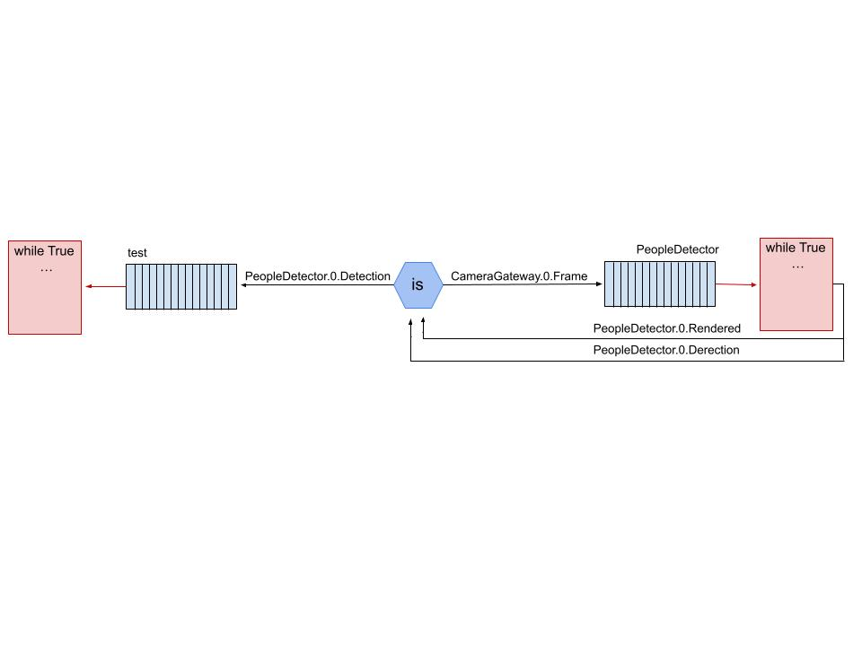

# is_project

O programa recebe continuamente imagens de uma câmera e então utiliza o descritor HOG(Histograma de Gradientes Orientados) para identificar regiões contendo pessoas e definir retângulos ao redor das detecções. Ao final desse processo, as informações das detecções são publicadas como objeto Protobuf dos tipos Image e ObjectAnnotations em um canal inicialmente definido.

